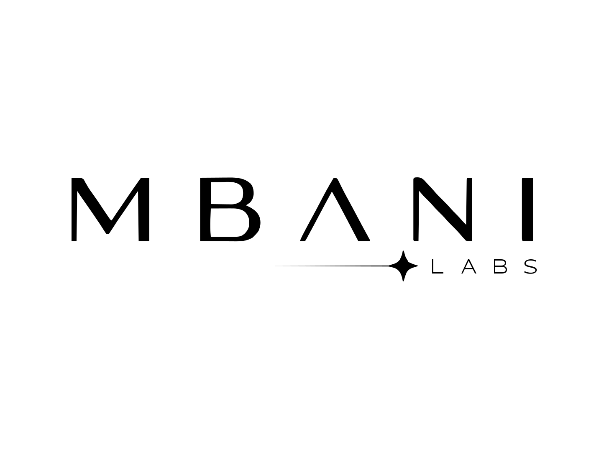
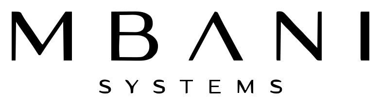

  

# Merveille Okouya

**Independent AI systems researcher & builder · MBANI**

I build and test AI, automation, data, and software systems under the **MBANI** identity.

## MBANI

MBANI is the parent identity for my research, engineering, and systems work.

  

**MBANI Labs** — research, experimentation, and capability exploration.

  

**MBANI Systems** — implementation and operational delivery.

**MBANI Nexus** — private internal infrastructure supporting MBANI work.

Internal methods, operating procedures, research workflows, decision frameworks, and unpublished system architecture are intentionally not published here.

## Current public work

### MBANI Agent Reliability Benchmark

Public research project focused on evaluating AI-agent behavior under difficult evidence conditions.

**Status:** active pre-experiment research. Formal benchmark results have not yet been published.

### Merveille OS

Local-first desktop software prototype for personal workflow and structured state management.

### Python Practice Vault

Python automation and learning-tooling project for organizing and maintaining local development work.

## Focus areas

- AI systems
- agent reliability
- automation engineering
- data systems
- Python
- full-stack prototyping
- deployment and infrastructure testing

## Public-work policy

This profile documents **what I am building and what has been verified publicly**.

Detailed MBANI Labs methods, proprietary operating logic, private research procedures, internal source material, and unpublished experiments remain private unless explicitly released.
